<div align="center">

# 🚀 Git & GitHub Command Reference

[](https://git-scm.com/)
[](https://github.com/)
[](http://makeapullrequest.com)
[](LICENSE)

**A comprehensive, developer-friendly guide to mastering Git and GitHub** 🎯

[Quick Start](#-quick-start) •
[Git Basics](#-git-basics) •
[Branching](#-branching--merging) •
[GitHub](#-github-workflows) •
[Advanced](#-advanced-operations) •
[Troubleshooting](#-troubleshooting)

---

</div>

## 📋 Table of Contents

<details>
<summary>Click to expand navigation</summary>

- [🎯 Quick Start](#-quick-start)
- [🔧 Git Basics](#-git-basics)
  - [Repository Setup](#repository-setup)
  - [Daily Workflow](#daily-workflow)
- [🌿 Branching & Merging](#-branching--merging)
- [☁️ GitHub Workflows](#-github-workflows)
  - [Remote Operations](#remote-operations)
  - [Collaboration](#collaboration)
- [⚡ Advanced Operations](#-advanced-operations)
- [🔥 Troubleshooting](#-troubleshooting)
- [📚 Additional Resources](#-additional-resources)

</details>

---

## 🎯 Quick Start

> **New to Git?** Here's the essential workflow to get you started in under 5 minutes!

```mermaid
flowchart LR
    A[📁 Clone/Init] --> B[✏️ Make Changes]
    B --> C[📦 Stage]
    C --> D[💾 Commit]
    D --> E[🚀 Push]
```



<details>
<summary><b>🚀 Your First Repository (Click to expand)</b></summary>

```bash
# 1. Clone an existing repository
git clone https://github.com/username/repository.git

# 2. Navigate into the project
cd repository

# 3. Make your changes, then stage them
git add .

# 4. Commit with a descriptive message
git commit -m "feat: add new feature"

# 5. Push to GitHub
git push origin main
```

</details>

---

## 🔧 Git Basics

### Repository Setup

| Command | Description | Example |
|---------|-------------|---------|
| `git init` | Initialize a new Git repository | `git init` |
| `git clone <url>` | Clone a remote repository | `git clone https://github.com/user/repo.git` |

<details>
<summary><b>💡 Initialize a New Repository</b></summary>

```bash
git init
```

**What it does:**
- Creates a hidden `.git` directory
- Begins tracking version history
- Sets up the repository structure

**Pro tip:** Always initialize in the root of your project directory!

</details>

<details>
<summary><b>💡 Clone an Existing Repository</b></summary>

```bash
git clone <repository_url>
```

**What it does:**
- Downloads the complete repository
- Sets up remote tracking automatically
- Creates a local working copy

**Example:**
```bash
git clone https://github.com/facebook/react.git
git clone git@github.com:facebook/react.git  # Using SSH
```

</details>

---

### Daily Workflow

```mermaid
flowchart TD
    subgraph Working["💻 Working Directory"]
        A[Modified Files]
    end
    
    subgraph Staging["📦 Staging Area"]
        B[Staged Changes]
    end
    
    subgraph Repository["💾 Local Repository"]
        C[Committed Snapshots]
    end
    
    A -->|git add| B
    B -->|git commit| C
    C -->|git push| D[☁️ Remote]
    D -->|git pull| A
```



<details>
<summary><b>🔍 Check Repository Status</b></summary>

```bash
git status
```

**Output explains:**
- 🔴 **Untracked files** - New files not yet tracked
- 🟡 **Modified files** - Changed but not staged
- 🟢 **Staged files** - Ready to be committed

**Short format:**
```bash
git status -s
```

</details>

<details>
<summary><b>➕ Stage Changes</b></summary>

```bash
# Stage a specific file
git add <file_name>

# Stage all changes in current directory
git add .

# Stage all changes (including deletions)
git add -A

# Interactive staging
git add -p
```

**Pro tips:**
- Use `git add -p` for selective staging of chunks
- Review staged changes with `git diff --staged`

</details>

<details>
<summary><b>💾 Commit Changes</b></summary>

```bash
git commit -m "Your commit message"
```

**Commit message best practices:**
```
type(scope): subject

body (optional)

footer (optional)
```

**Types:** `feat`, `fix`, `docs`, `style`, `refactor`, `test`, `chore`

**Examples:**
```bash
git commit -m "feat(auth): add OAuth2 login support"
git commit -m "fix(api): resolve null pointer exception"
git commit -m "docs(readme): update installation steps"
```

</details>

<details>
<summary><b>🔄 Sync with Remote</b></summary>

```bash
# Pull latest changes
git pull origin <branch_name>

# Push your changes
git push origin <branch_name>
```

**Pull with rebase (cleaner history):**
```bash
git pull --rebase origin main
```

</details>

<details>
<summary><b>📜 View Commit History</b></summary>

```bash
# Full log
git log

# Compact one-line format
git log --oneline

# Visual graph
git log --oneline --graph --all

# Last N commits
git log -n 5
```

**Beautiful log alias:**
```bash
git log --pretty=format:"%C(yellow)%h%Creset %s %C(cyan)(%cr)%Creset %C(green)<%an>%Creset"
```

</details>

---

## 🌿 Branching & Merging


| Command | Description |
|---------|-------------|
| `git branch` | List branches |
| `git branch <name>` | Create new branch |
| `git checkout <name>` | Switch to branch |
| `git checkout -b <name>` | Create and switch |
| `git merge <branch>` | Merge branch into current |
| `git branch -d <name>` | Delete branch |

<details>
<summary><b>🌱 Create a New Branch</b></summary>

```bash
# Create a branch
git branch <branch_name>

# Create and switch in one command
git checkout -b <branch_name>

# Modern alternative (Git 2.23+)
git switch -c <branch_name>
```

**Naming conventions:**
- `feature/add-login`
- `bugfix/fix-header`
- `hotfix/security-patch`
- `release/v1.2.0`

</details>

<details>
<summary><b>🔀 Switch Branches</b></summary>

```bash
# Classic command
git checkout <branch_name>

# Modern command (Git 2.23+)
git switch <branch_name>
```

**Check current branch:**
```bash
git branch --show-current
```

</details>

<details>
<summary><b>🔗 Merge Branches</b></summary>

```bash
# First, switch to the target branch
git checkout main

# Merge the feature branch
git merge <feature_branch>
```

**Merge strategies:**
```bash
# Fast-forward merge (if possible)
git merge --ff-only feature

# No fast-forward (preserves branch history)
git merge --no-ff feature

# Squash all commits into one
git merge --squash feature
```

</details>

---

## ☁️ GitHub Workflows

### Remote Operations

<details>
<summary><b>🔗 Configure Remote</b></summary>

```bash
# Add a remote
git remote add origin <repository_url>

# View remotes
git remote -v

# Change remote URL
git remote set-url origin <new_url>

# Remove remote
git remote remove origin
```

</details>

<details>
<summary><b>🔼 Set Upstream Branch</b></summary>

```bash
git branch --set-upstream-to=origin/<branch_name>

# Or when pushing for the first time
git push -u origin <branch_name>
```

</details>

<details>
<summary><b>📥 Fetch vs Pull</b></summary>

```bash
# Fetch: Download changes without merging
git fetch origin

# Pull: Fetch + Merge
git pull origin <branch_name>
```

| Fetch | Pull |
|-------|------|
| Downloads updates | Downloads + merges |
| Safe, no changes to working directory | May cause conflicts |
| Review before merging | Immediate integration |

</details>

<details>
<summary><b>🌐 Manage Remote Branches</b></summary>

```bash
# View remote branches
git branch -r

# View all branches (local + remote)
git branch -a

# Delete a remote branch
git push origin --delete <branch_name>

# Prune stale remote-tracking branches
git fetch --prune
```

</details>

---

### Collaboration

<details>
<summary><b>🍴 Fork & Contribute</b></summary>

**Workflow:**
1. **Fork** the repository on GitHub (click "Fork" button)
2. **Clone** your fork locally
3. **Create** a feature branch
4. **Make** your changes
5. **Push** to your fork
6. **Open** a Pull Request

```bash
# Clone your fork
git clone https://github.com/YOUR_USERNAME/repo.git

# Add upstream remote
git remote add upstream https://github.com/ORIGINAL_OWNER/repo.git

# Keep your fork updated
git fetch upstream
git merge upstream/main
```

</details>

<details>
<summary><b>🔔 Pull Requests</b></summary>

**Creating a PR:**
1. Push your branch to GitHub
2. Navigate to the repository
3. Click "Compare & pull request"
4. Fill in the PR template
5. Request reviewers

**PR Best Practices:**
- ✅ Write descriptive titles
- ✅ Reference related issues (`Fixes #123`)
- ✅ Keep changes focused and small
- ✅ Respond to review feedback promptly

</details>

---

## ⚡ Advanced Operations

<details>
<summary><b>↩️ Undo Changes</b></summary>

```bash
# Discard changes in working directory
git checkout -- <file_name>
# Modern alternative
git restore <file_name>

# Unstage a file
git reset HEAD <file_name>
# Modern alternative
git restore --staged <file_name>

# Undo last commit (keep changes)
git reset --soft HEAD^

# Undo last commit (discard changes)
git reset --hard HEAD^
```

> ⚠️ **Warning:** `--hard` permanently deletes uncommitted changes!

</details>

<details>
<summary><b>📦 Stash Changes</b></summary>

```bash
# Stash current changes
git stash

# Stash with a message
git stash save "work in progress"

# List stashes
git stash list

# Apply latest stash
git stash pop

# Apply specific stash
git stash apply stash@{2}

# Clear all stashes
git stash clear
```

</details>

<details>
<summary><b>🏷️ Tags</b></summary>

```bash
# Create a tag
git tag v1.0.0

# Create annotated tag
git tag -a v1.0.0 -m "Release version 1.0.0"

# Push tags to remote
git push origin --tags

# Delete a tag
git tag -d v1.0.0
git push origin :refs/tags/v1.0.0
```

</details>

---

## 🔥 Troubleshooting

<details>
<summary><b>🆘 Common Issues & Solutions</b></summary>

### "I committed to the wrong branch!"
```bash
# Move commits to a new branch
git branch new-branch
git reset --hard HEAD~1
git checkout new-branch
```

### "I need to change my last commit message!"
```bash
git commit --amend -m "New message"
```

### "I accidentally deleted a branch!"
```bash
# Find the lost commit
git reflog
# Recreate the branch
git branch recovered-branch <commit-hash>
```

### "I have merge conflicts!"
```bash
# See conflicting files
git status

# After fixing conflicts manually
git add <resolved-files>
git commit
```

</details>

---

## 📚 Additional Resources

| Resource | Description |
|----------|-------------|
| [Pro Git Book](https://git-scm.com/book/en/v2) | Comprehensive Git guide |
| [GitHub Docs](https://docs.github.com/) | Official GitHub documentation |
| [Git Cheat Sheet](https://education.github.com/git-cheat-sheet-education.pdf) | Printable reference |
| [Oh Shit, Git!?!](https://ohshitgit.com/) | Common mistake fixes |
| [Learn Git Branching](https://learngitbranching.js.org/) | Interactive tutorial |

---

<div align="center">

### ⭐ Found this helpful? Give it a star!

**Made with ❤️ for developers**

[](https://github.com/nihalgbailur/github_commands)

</div>
